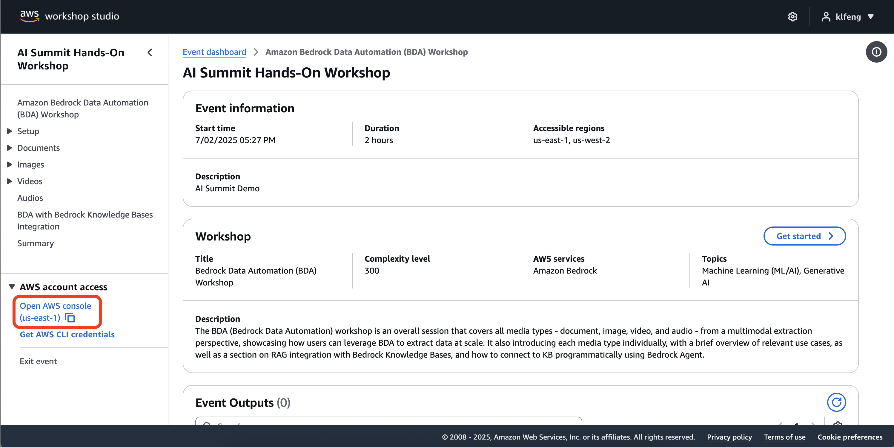
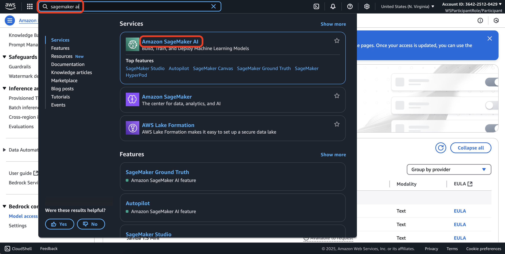
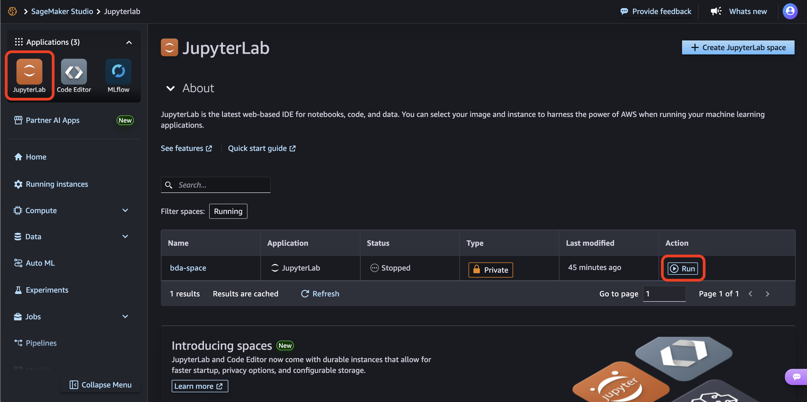
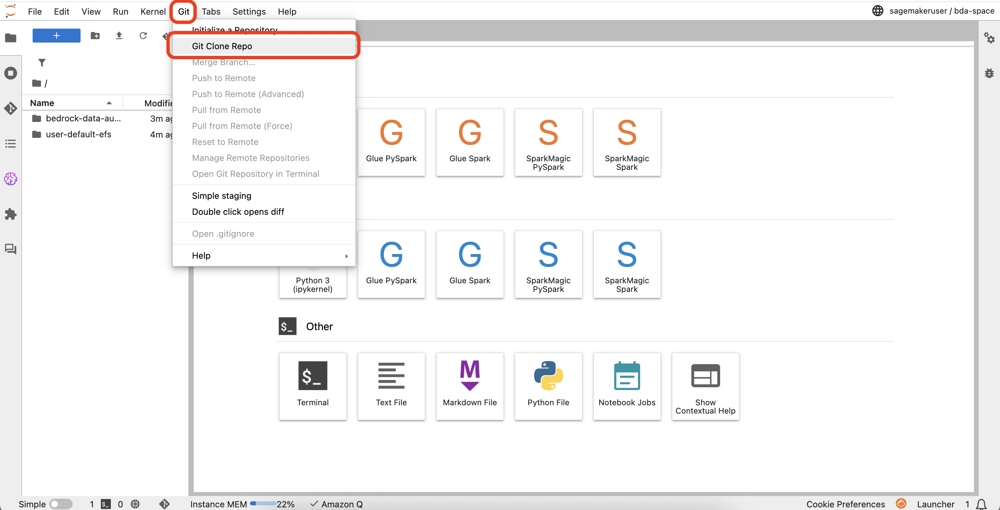
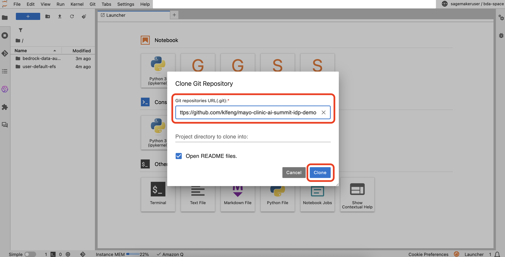
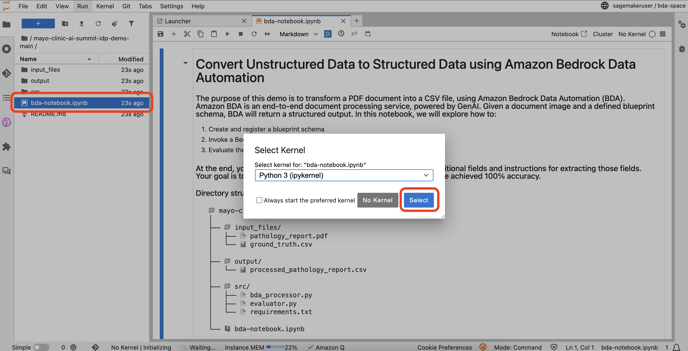

# Convert unstructured data to structured data using Amazon Bedrock Data Automation

## Step 1: Navigate to the AWS Workshop [here](https://catalog.us-east-1.prod.workshops.aws/join?access-code=617a-086d38-16) and open the AWS Console

 

## Step 2: Request access for Claude 3.5 Haiku
#### 3a. Navigate to Amazon Bedrock using the search bar

 

#### 2b. Click on Model access (located at the bottom of the left panel) and search for "Claude 3.5 Haiku"

 

#### 2c. Hover over "Available to request" and request model access

 

#### 2d. Submit request for model access

 

## Step 3: Setup Jupyter Notebook 
#### 3a. Navigate to Amazon SageMaker AI using the search bar

 

#### 3b. Click on Studio (located towards the top of the left panel) and click on "Open Studio"

 

#### 3c. Click on the "JupyterLab" icon and run the space 

 

##### 3d. Select Git (located in the top header) and click on "Git Clone Repo"

 

##### 3e. Copy and paste the GitHub URL (https://github.com/klfeng/mayo-clinic-ai-summit-idp-demo) and click on "Clone" 

 

##### 3f. Inside the repository folder, select "bda-notebook.ipynb" and choose the "Python 3" kernel when prompted

